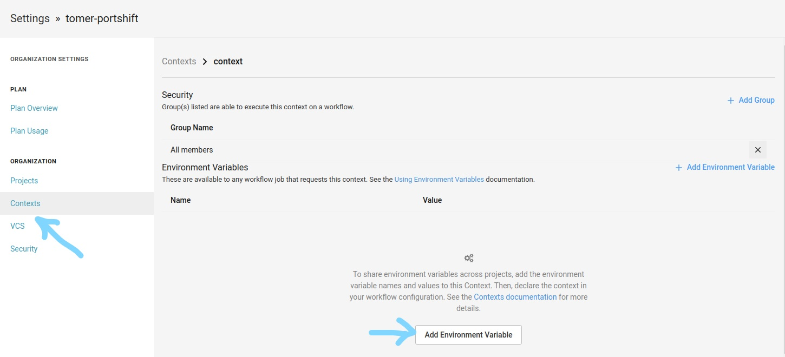
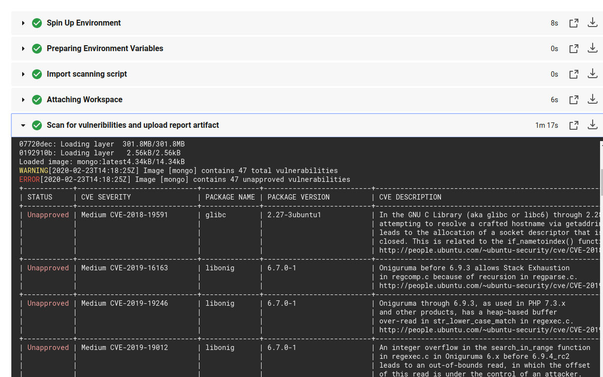

# **Portshift Orb for CircleCi**

## **What is Portshift Orb?**
With this orb you can easily integrate Portshift identity creation and vulnerabilities scans into your CircleCI Workflows.
Portshift identity creation is essential part of Portshift runtime security, authenticating and authorizing containers build and deployments with vulnerabilities scan results. The scan engine is currently based on [Clair](https://github.com/quay/clair), in the future additional scan engines will be added to Portshift Orb to enhance the vulnerabilities information. 
Portshift Orb is an easy way to get started with Portshift runtime security platform, the image identity and the vulnerabilities scan results will be shown in Portshift Management platform.

## **How to use Portshift Orb**

### **Prerequisites**
1. User-Account: Create a user account in portshift (note: Portshift is a s commercial software, so you'll need a license to create a user accouunt before using this orb Go to: [www.portshift.io](www.portshift.io). After receiving a "New User" onboarding email, go to Portshift's user-portal (www.console.portshift.io) to enter your domain.

2. Define Service Account: In the user domain you need to define a new "service account":

3. Go to System (upper tab "manage users")

4. Create new user with service user role
  
     

5. After creating a new service user select its "token" from the users table
  
     


6. In the token page, copy the "Access Key" and ""Secret Key" (you can use the copy icon on their right side)
  
7. In CircleCI App go to "Organization Settings"-> Context ->Create new Context
  
     


8. Create 2 new environment variables for Portshift's "Access Key" and "Secret Key" 
  
### **Adding Portshift Orb to your pipeline**

Create a a directory where you will build your image. This will later be persisted to a [Workspace](https://circleci.com/docs/2.0/concepts/#workspaces-and-artifacts)

`- run: mkdir -p workspace `

Build your image

`- run: docker build -t <myrepo/myimage:tag>`

Save the image to the workspace:

```
 - persist_to_workspace:
          root: workspace
          paths:
              - image.tar
```

Add Portshift Orb

`portshiftscanner: 'portshift/portshift-scanner@1.0.0`

Create a new job for Portshift Orb

```
jobs:
      - docker-build
      - portshiftscanner/scan-image:
          requires:
            - docker-build
          context: portshift-credentials
          image_name: <image-name>
          image_tag: <image-tag>
          access_key: ${ACCESS_KEY}
          secret_key: ${SECRET_KEY}
```

### **Orb Output**

In the job's output you can see the vulnerabilities scan results
   
   
   

In portshift management "images tab" you'll see a new record with your image identity,vulnerabilities scan results


